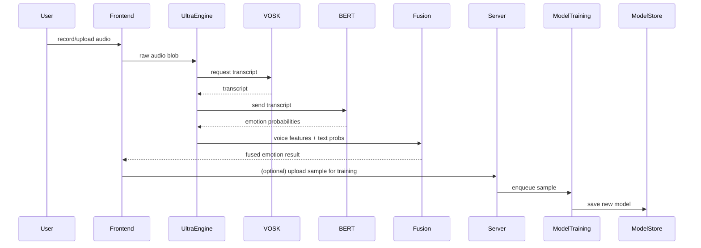
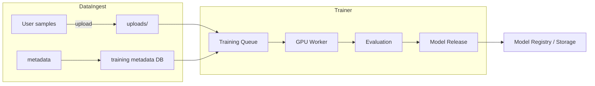
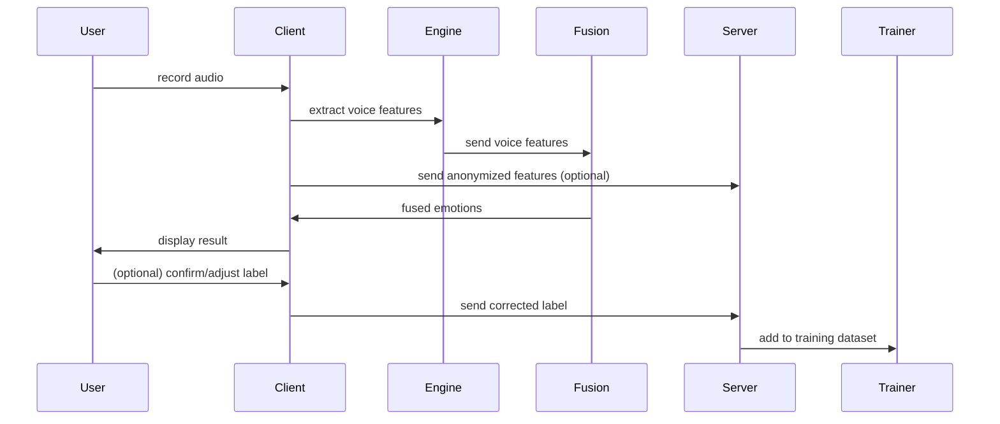
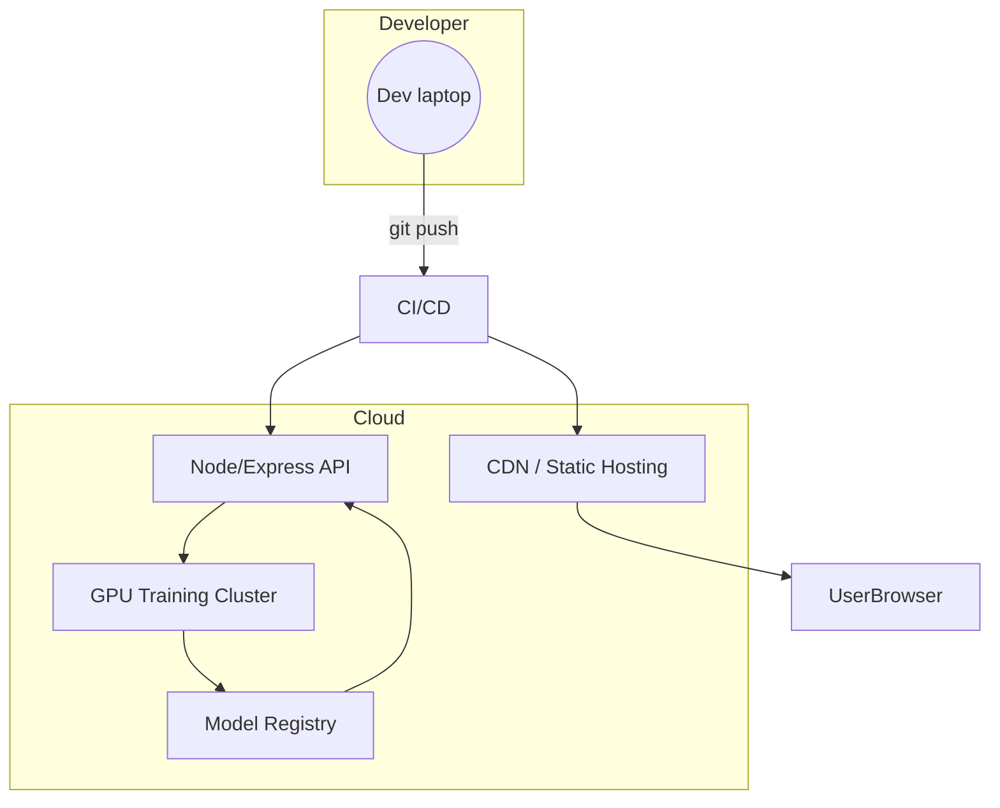

# Detailed Architecture Diagrams — NLP Emotion Detection Project

This file expands the high-level architecture into several focused diagrams (Mermaid) and explanations: logical components, data flows, training pipeline, sequence flows, and deployment topology.

## How to view
- Copy any Mermaid block below to https://mermaid.live to render diagrams, or use VS Code Mermaid preview extensions.

## 1) Logical Component Diagram

```mermaid
flowchart LR
  subgraph Frontend[Frontend - React SPA (Vite)]
    A1[App-simple.jsx]
    A2[VoiceEmotionSystem.jsx]
    A3[UI Components & Charts]
  end

  subgraph ClientEngines[Client Engines (src/utils)]
    E1[UltraEnhancedEmotionEngine]
    E2[EnhancedAudioProcessorV3]
    E3[SentimentFusionEngine]
    E4[EnhancedBERTAnalyzer]
    E5[VOSK Loader / Local ASR]
  end

  subgraph Server[Backend - Node/Express]
    S1[Training API (/api/training-data)]
    S2[Model Training Queue]
    S3[Blob Storage / uploads/]
  end

  subgraph Models[Model Artifacts]
    M1[VOSK ASR models]
    M2[BERT / Transformers (remote or service)]
    M3[Fine-tuned Emotion Classifier]
  end

  A2 --> E2
  A2 --> E1
  E2 --> E1
  A2 --> E4
  E4 --> M2
  A2 --> S2
  A2 --> S1
  S1 --> S3
  S3 --> M3
  M1 --> E5
  E5 --> E2

  style Frontend fill:#f0f9ff,stroke:#90cdf4
  style ClientEngines fill:#eef2ff,stroke:#c7d2fe
  style Server fill:#f0fff4,stroke:#9ae6b4
  style Models fill:#fffaf0,stroke:#ffd59e
```

### Notes
- The front-end orchestrates audio capture, preview, and orchestration between engines.
- Client-side engines do most of the heavy lifting to avoid sending raw audio to remote services when possible (privacy-first).

## 2) Data Flow (Detailed)



### Notes
- ASR may be local (VOSK) or remote depending on device constraints.
- BERT analysis may be performed remotely or via a light client-wrapper.

## 3) Training Pipeline



### Notes
- The pipeline supports continuous training: user-labeled samples get queued for periodic retraining.
- Model releases are versioned and can be deployed to a BERT inference endpoint or packaged for client-side use.

## 4) Sequence: Inference & Feedback Loop



## 5) Deployment Topology



### Notes on deployment
- Frontend: build with Vite and host on static CDN (Netlify/Vercel). Use environment flags to point to local VOSK models when available.
- Backend: Node/Express for collection, queuing, and model management. Optionally containerize model workers with Docker + GPU nodes.

---

If you want I can:
- Render these Mermaid diagrams to SVGs and add them under `docs/assets/`.
- Create a lightweight README in `docs/` with runbook steps (how to enable local BERT, where VOSK models go, how to start training worker).

Which of the extras should I do next?